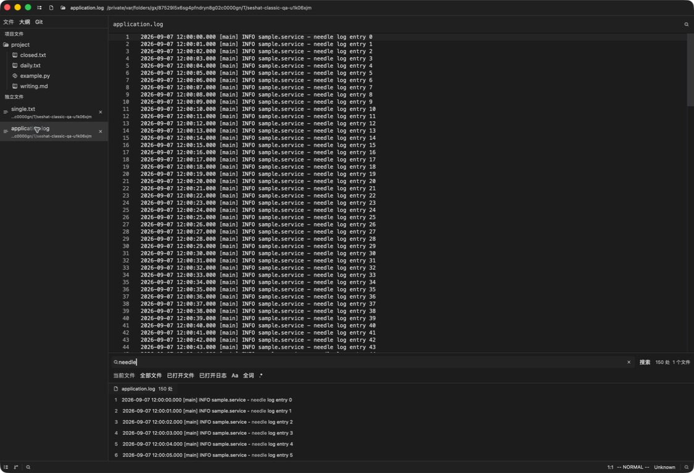
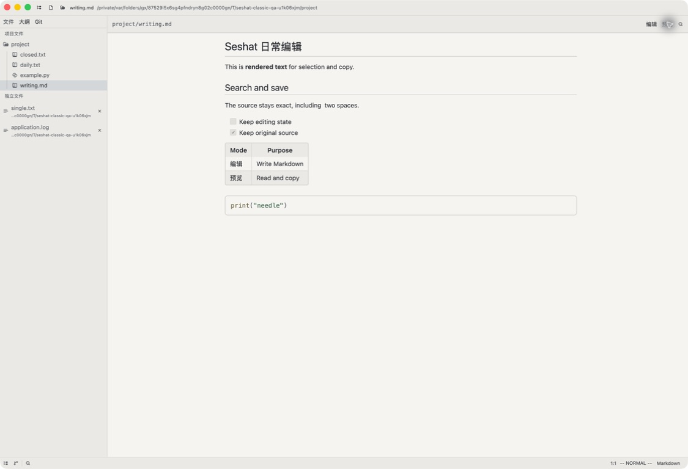

# Classic Seshat workflow acceptance

The owner asked to restore the earlier Seshat layout and palette, bottom scoped search, explicit Markdown Edit/Preview modes, and separate project/standalone file trees. The private reference screenshot is not copied into this repository. All visual and filesystem evidence uses task-created neutral fixtures on the owner's Mac.

## Result and source

Core implementation: `f427aa3`. Native findings fixed in `fe45dcb`; final appearance/settings polish: `c2b63dd`. [The maintained contract](../../../.lattice/spec/seshat-foundation.md) describes the current behavior. The older core-only audit's future in-place Markdown direction is superseded by this request.

The source buffer and undo history remain in upstream Editor/Buffer. Preview is a snapshot inside the same Editor item, so there is one document owner. Project search uses the existing project search engine and source anchors. Opened-file scopes derive from actual workspace items, not buffers loaded only by a prior search. Project roots keep their normal tree; standalone roots have a separate virtual list, parent path and close button.

## Final native appearance

| Graphite log search and two file trees | Warm-paper Markdown Preview |
| --- | --- |
|  |  |

[Dark Preview](final-dark-preview.png), [first settings write before](preferences-before-first-write.png), and [after](preferences-after-first-write.png) also show the final source build. The first preference write preserves the 12 px editor and 14 px UI defaults.

## Observed native journeys

| Journey | Observation |
| --- | --- |
| Current file, Cmd+F | `needle` finds 3 matches in daily.txt. Case plus whole-word finds exactly 1. |
| All files, Cmd+Shift+F | Finds 157 matches across 6 files, including unopened project files and standalone logs. |
| Opened files | Finds 155 matches across 4 files; the prior all-files search does not silently add closed files to this scope. |
| Opened logs | Finds 151 matches across ordinary and rotated logs. |
| Invalid regex and Escape | `[` clears old results and displays the error. A valid replacement recovers. Escape closes the bottom panel and restores editor focus without quitting. |
| Match activation | Text result activates line 4 with 7 selected characters. From Markdown Preview, a result switches the same item to Edit and activates line 18 with 6 selected characters. |
| Standalone close | Cancel keeps the row and dirty content. Save writes the exact edited text then removes the root; a same-named file in another directory remains. Don't Save removes that other root while its disk hash remains unchanged. Neither file is deleted. Repeated clicks produce one close flow. |
| Markdown mode state | An unsaved paragraph appears in Preview. Cmd+A/C copies rendered paragraphs, list, table and code. Cmd+Shift+V returns to Edit; Vim undo and Save restore the exact original Markdown SHA-256. |
| Logs | Vim deletion, insertion and Save leave both application.log and archive.LOG.1 unchanged on disk. |
| Git | Native Stage selects daily.txt in the index; native Unstage empties the index. Undo and Save restore the fixture baseline. No remotes are configured. |
| Theme and outline | Graphite and warm-paper surfaces render in the native app. The outline exposes the document's headings. The final File/Outline/Git order is stable. |
| Final search controls | Clicking the whitespace on the result row selects the source match. Clear removes the query and old results and restores the waiting state. |
| Save while previewing | Cmd+S in Preview writes the edited source. Return to Edit, undo and Save restore the initial source hash. |
| Restart | Final c2b63dd restores two dirty buffers and the two file trees. Closing a restored draft still prompts. After the task-owned drafts are discarded, all original project/log hashes and the empty Git index are verified. |

See [native receipts](native-acceptance.json), [standalone save/discard disk proof](standalone-close-receipt.json), and [copied rendered text](copied-markdown.txt). Images below are evidence of the named journey, not a performance benchmark.

## Regressions found during native use

- Escape synchronously closed the dock while the search panel was borrowed for update, causing a repeatable GPUI entity-update panic. A dispatched Cancel regression failed before the fix. Deferring dock closure resolves it.
- Closing a dirty standalone file shown in two splits removed one view before the final Save/Cancel choice. The expanded close regression failed on the remaining item count. Preflight save prompts and a per-root pending-close guard preserve both views on Cancel.
- A long standalone parent path pushed its close control beyond the sidebar. The standalone list now fits the panel width and truncates the path from the start.
- The first preference write seeded upstream 16/15 px fonts and One themes, changing settings the person had not selected. A first-write test failed against the merged appearance. The initial file now contains only explicit user overrides, so defaults remain inherited.

## Verification and limits

Final `c2b63dd` passed [275 automated checks and cargo check](verification.log), the [release-fast build](bundle.log), and strict ad-hoc signature verification. The clean source build is recorded in [the bundle receipt](build-receipt.json). Native core journeys ran on `fe45dcb`; final `c2b63dd` additionally passed session restoration, first preference writes, corrected sidebar order, whole-row search clicks, clearing, and saving from Preview. [Restored text](restored-daily-draft.png) and [restored Markdown](restored-markdown-draft.png) are observed native results. Both task-owned drafts were then discarded through their native close prompts. Source-level regressions cover search scope and cancellation, Markdown mode state/lifetime, standalone close cancellation across splits, and initial preference writes. The declared script also checks the removed-workbench source boundary and existing editing, read-only, Vim, Markdown, session and Git regressions.

The local application is ad-hoc signed; no notarization or cross-platform execution is claimed. Very large logs still use the ordinary read-only text buffer, as stated in the existing contract. There is no live/WYSIWYG Markdown requirement in this change.
