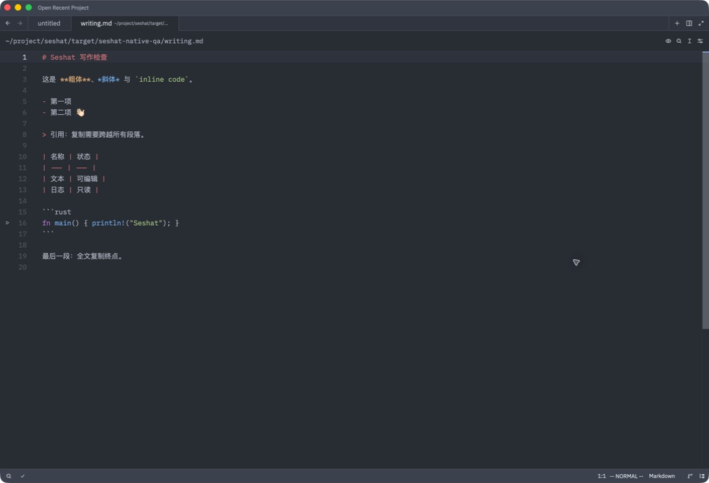
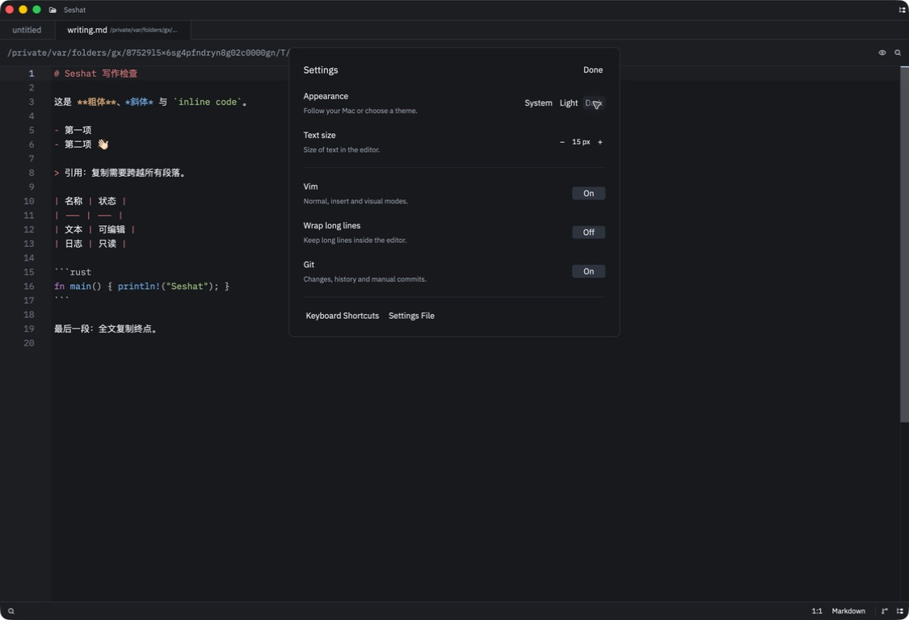
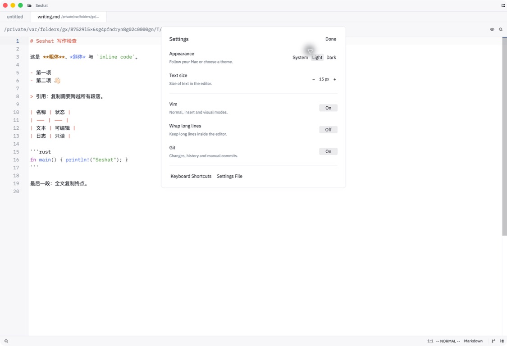

# Focused Seshat acceptance

Scope: the owner's Mac, source branch `codex/seshat-core-only`, local ad-hoc signed application. No public release or notarization is claimed.

## Source boundary

The application retains 149 Cargo workspace packages. 102 unreachable packages were removed, including the AI/provider/agent/MCP, collaboration UI/call/audio, remote workspace/server/container, terminal UI, debugger UI, REPL, extension host/installer, full workbench settings/sidebar and updater implementations. See [the removed-package inventory](removed-crates.json) and [the maintained boundary](../../../.lattice/spec/seshat-foundation.md). Shared editor/project protocol and schema abstractions remain, as documented there. Upstream deployment and repository-automation workflows were removed.

`script/seshat-verify` checks source/package absence and targeted application, Markdown, preview, read-only editor, Vim undo, Git staging and workspace-retention behavior. Its 270 tests passed (66 application, 156 Markdown, 20 preview, 2 release-channel, 1 workspace boundary, 6 read-only, 6 Vim undo and 13 Git staging; one existing platform-timing test is ignored). Relevant test findings: workspace retention must be independent of the removed Agent sidebar; opening a preview must focus its Markdown child so immediate Cmd+A/C works; preview session tests need separate databases because parallel tests reuse the same fixture paths.

## Native appearance

The title bar, toolbar and settings are focused on file editing. The file tree opens on the left; inline Git blame is off by default. Settings expose System/Light/Dark, text size, Vim, line wrapping and Git. Native preference toggles were observed and restored to 15 px, Vim on, wrapping off and Git on.

| Before | Seshat Dark settings | Seshat Light settings |
| --- | --- | --- |
|  |  |  |

## Native behavior

The core build `b823bcc` passed the following native journeys on this Mac, using only task-created files in a temporary local Git repository with no remotes. The final source `0bf7466` additionally removes stale terminal/worktree-task shortcuts and MCP/LSP prompt text; it does not change buffer, Git or persistence behavior.

| Journey | Observed result |
| --- | --- |
| Vim / save / undo | `ggdd` removed the first line; native Save produced the exact expected bytes. `u` and Save restored the baseline SHA, including Chinese and emoji. |
| Find / replace | Native find located `beta`; replacement with `BETA` saved exactly to disk. |
| Preview copy | Clicking the preview button then immediately Cmd+A/C copied heading, lists, quote, table, code and final paragraph. Markdown source SHA was unchanged. |
| Read-only logs | `app.log` and `archive.LOG.1` rejected Vim deletion and inserted text; Save left both SHA values unchanged. |
| Git | Native Stage and Unstage changed the Git index as expected. The fixture has no remotes and no network Git action was invoked. |
| Dirty close | Closing `notes.txt` displayed Save / Don't Save / Cancel. Cancel kept its unsaved tab open. |
| Session restore | Normal Quit retained two unsaved buffers in the local session database. Relaunch with the same persistent profile restored both draft markers and the text, preview and log tabs while disk files still held their pre-draft contents. |
| Cleanup | Native Save All wrote both task-created drafts. The fixture index was empty. No unrelated user file was opened or saved. |

See [the disk/hash receipt](native-acceptance.json), [rendered copied text](copied-markdown.txt), [preview copy](preview-copy.png), [Git staging](git-staged.png), [read-only log](read-only-log.png), [first restored draft](restored-daily-draft.png), [second restored draft](restored-notes-draft.png), and [close confirmation](dirty-close-confirmation.png).

The native automation occasionally returned an unchanged image after an action; activating the application refreshed it. Actions were verified through a fresh image, disk/index readback, or a native confirmation, not by assuming a key press succeeded. No forced quit was used.

## Final bundle

Final source `0bf7466cd7d3137badb3a62ba2f1bb316946a5d1` passed [270 checks and cargo check](verification.log), the [release-fast build](bundle.log), and strict ad-hoc signature verification. The generated application is **176.2 MiB**, compared with the previous approximately 358 MiB bundle; this is a size comparison, not a startup-latency benchmark. See the [build/hash receipt](build-receipt.json).

The final signed app was launched with the same persistent profile. Saved text and prior tabs restored, and the [folder-settings prompt](folder-settings-prompt.png) now describes only folder settings, without the deleted MCP/LSP features. The core native journeys above use the same editor/Git/persistence implementation as this final bundle.

## Limits

This keeps source editing and Markdown preview as separate surfaces. Typora-style in-place rich editing and bounded-memory loading of very large logs are still separate product work. Logs currently use the ordinary read-only text buffer. No Intel, Windows or Linux package execution is claimed. The original Zed installation and unrelated user documents are preserved.
